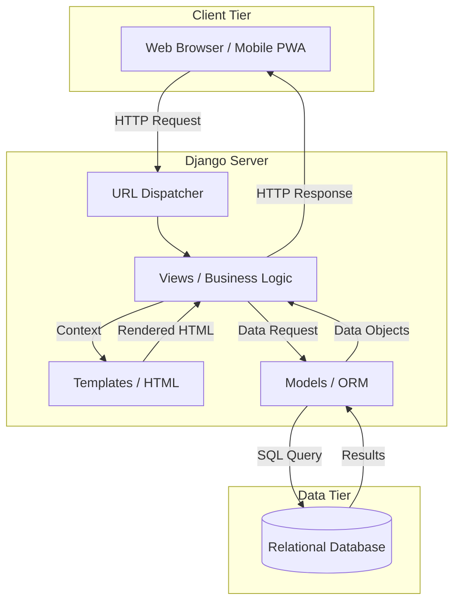
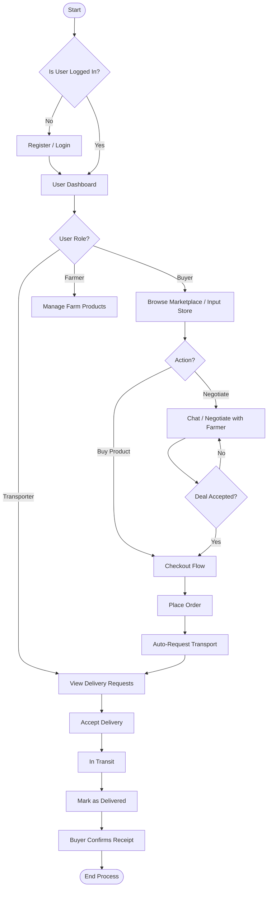
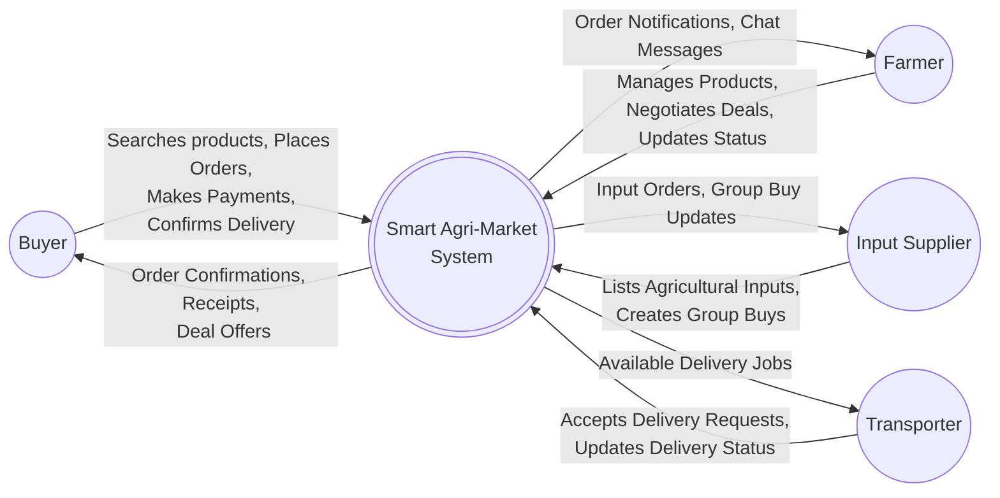
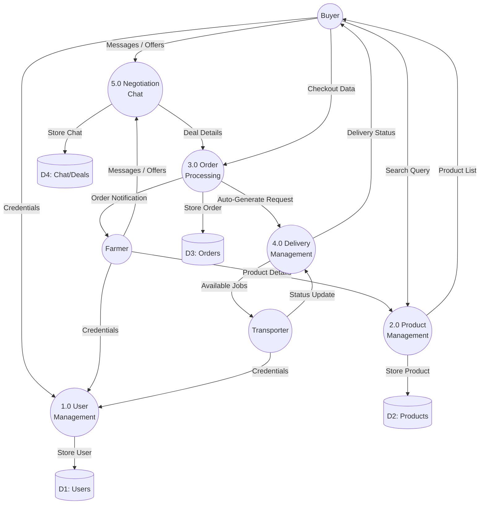
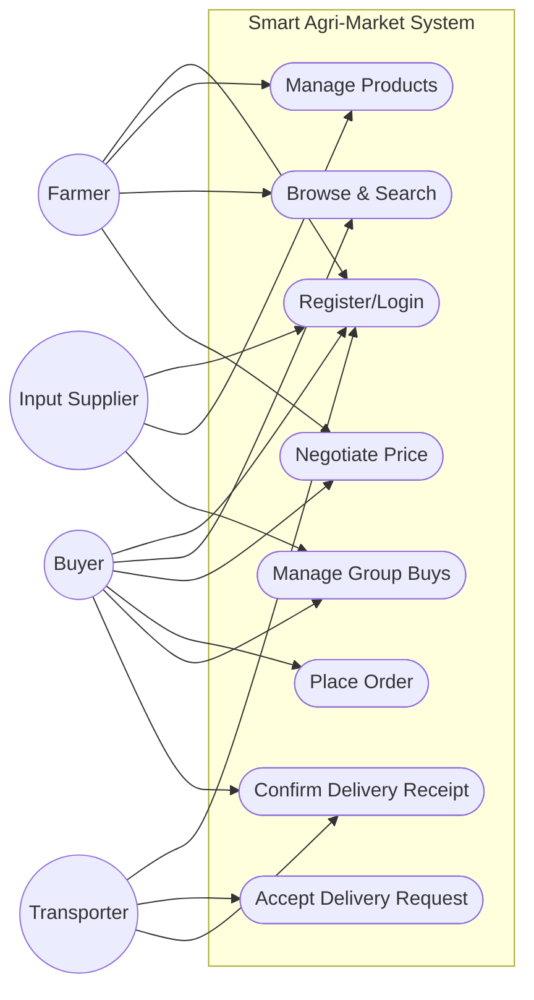
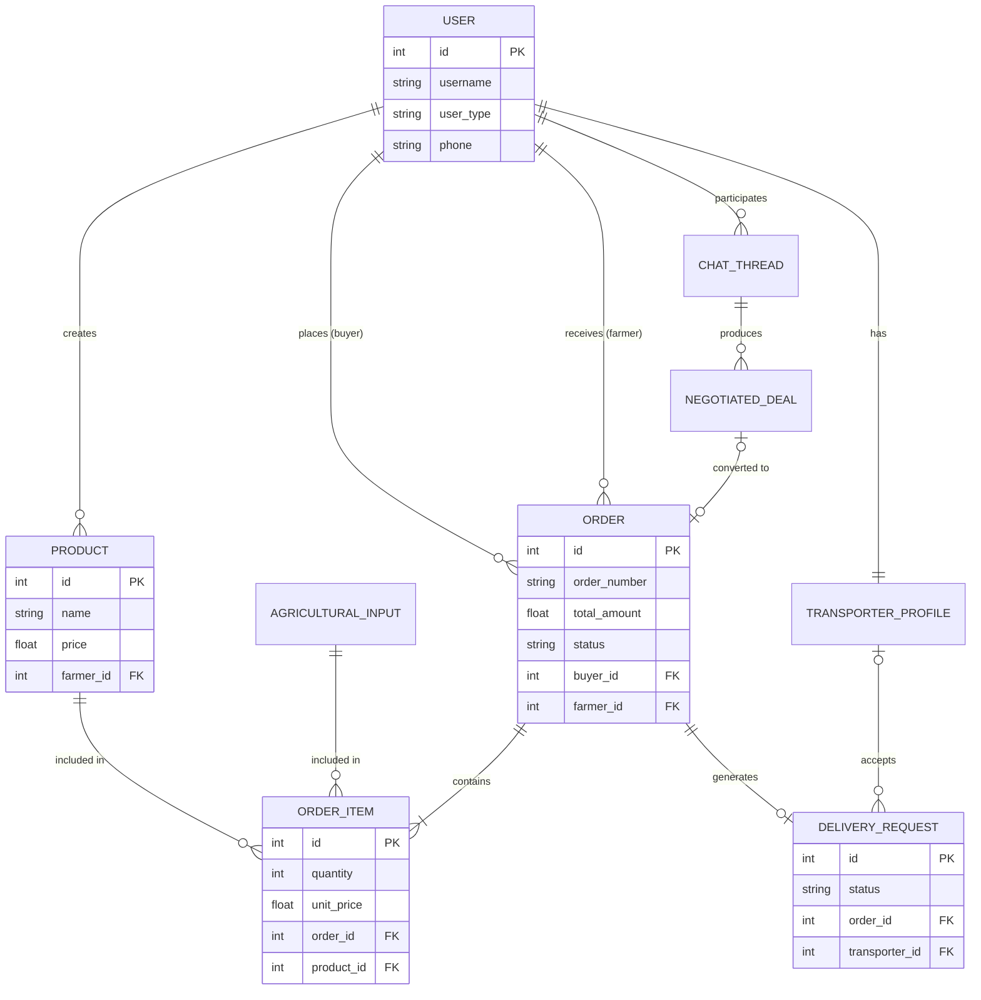
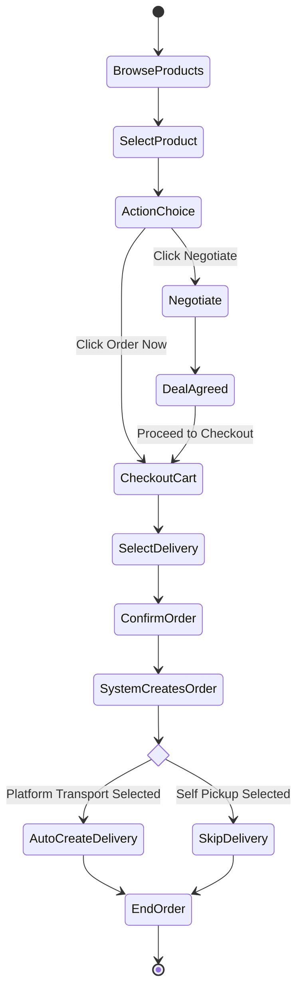
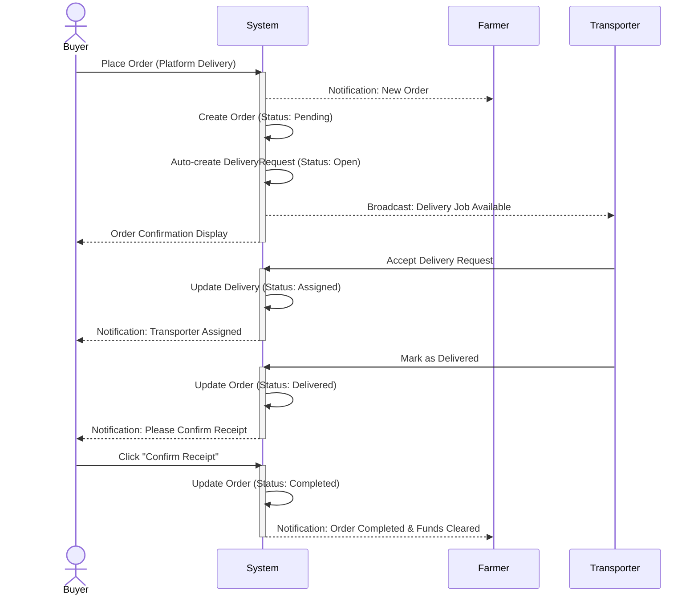
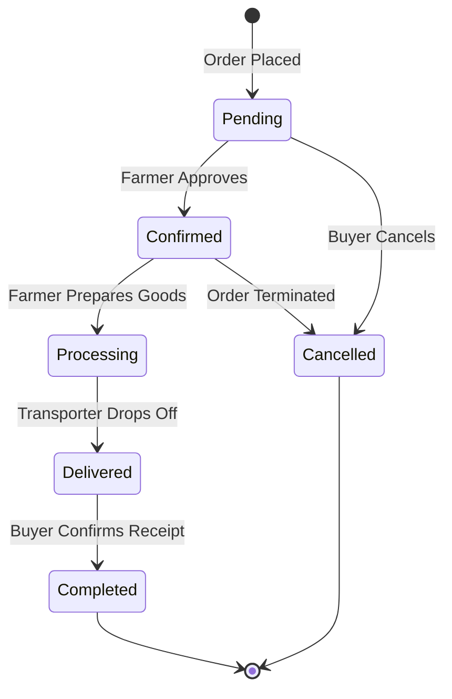

 # CHAPTER FOUR: SYSTEM ANALYSIS AND DESIGN DIAGRAMS

This document contains the system design models and diagrams for the Smart Agri-Market Platform. The diagrams are generated using **Mermaid.js** syntax, which can be rendered directly in most modern Markdown viewers, GitHub, or by pasting the code blocks into [Mermaid Live Editor](https://mermaid.live).

---

## 4.6 High Level Architecture of the Developed System

The system follows a three-tier architecture utilizing the Django MVT (Model-View-Template) pattern.


*(Alternatively, standard flowchart representation of the architecture)*



---

## 4.7 The Flow Chart of the Developed System

This flowchart illustrates the general user journey and decision logic within the platform.



---

## 4.8 The Context Diagram (Level 0 DFD)

The Context Diagram shows the system as a single process interacting with external entities (actors).



---

## 4.8.1 The Level One DFD

This diagram breaks the main system down into major sub-processes.



---

## 4.9 The Use Case Diagram

*Note: In Mermaid, Use Case diagrams are drawn using flowcharts or state diagrams styled to look like Use Cases.*



---

## 4.10 Entity Relationship Diagram (ERD)

Shows the database structure and relationships between core models.



---

## 4.11 Dynamic Modeling

### 4.11.1 Activity Diagram (Order Placement Flow)

Shows the step-by-step activity of placing an order.



### 4.11.2 Sequence Diagram (Delivery Automation)

Illustrates the time-based communication between objects when an order is placed and delivered.



### 4.11.3 Collaboration Diagram

Since Mermaid does not have a native Collaboration Diagram (Communication Diagram) syntax, we use a flowchart to represent the object interactions and sequence numbers.

```mermaid
flowchart TD
    B(1: Buyer Object)
    C(2: Checkout Controller)
    O(3: Order Model)
    D(4: DeliveryRequest Model)
    T(5: Transporter Object)

    B -->|1. submitOrder()| C
    C -->|2. create()| O
    O -->|3. save()| O
    C -->|4. autoRequest()| D
    D -->|5. notifyAvailable()| T
    T -->|6. acceptDelivery()| D
```

### 4.11.4 State Chart Diagram (Order Lifecycle)

Shows the various states an `Order` object goes through during its lifecycle.


